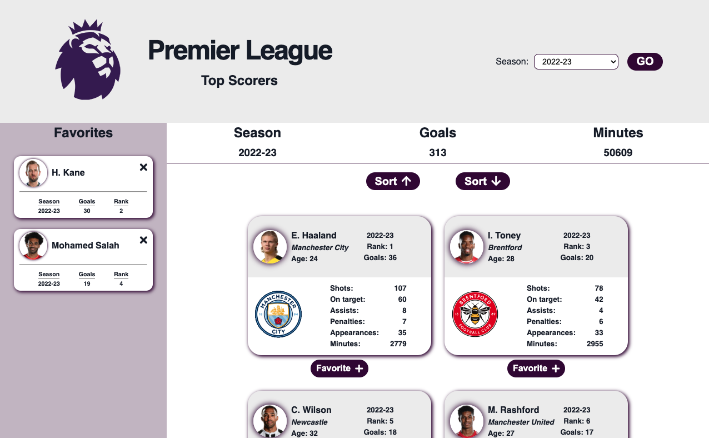

# Top Scorers

[https://knightmac19.github.io/Top-Scorers/](https://knightmac19.github.io/Top-Scorers/)

### With this application users can retrieve a list of yearly English Premier League top scorers from a third-party API. Players are each displayed in a card, the list can be sorted by rank, and users can add player cards to a 'Favorites' section.

##  Languages & Technologies

[Contents](#contents)  

##  Contents

- [Languages](#languages)
- [Description](#description)
- [Motivation](#motivation)
- [Usage](#usage)
- [Challenges](#challenges)
- [Contributors](#contributors)
- [License](#license)

##  Description

[Contents](#contents)  
This applications uses simple HTML, CSS, and vanilla JavaScript to fetch data from the API, display the player cards, sort the items, etc. The player cards for both the main and favorites sections are generated dynamically using JavaScript. The application is fully responsive and functional for all devices down to 280px wide. Adding a players card to the favorites section removes that card from the main collection and vice versa. Future versions could include some lightweight data persistence of the favorited player cards with the help of browser tools such as localStorage.

##  Motivation

[Contents](#contents)  
For this project I wanted to demonstrate a simple site that: fetches data from a third-party API, programatically generates HTML using vanilla JS, allows users to execute some manipulation of the generated DOM nodes (sorting the cards by rank), and is fully responsive.

##  Usage

[Contents](#contents)  
Users can access the site from a desktop, tablet, or mobile device using their internet browser.

##  Challenges & Lessons Learned

[Contents](#contents)  
One of the challenges was handling state between the main card collection and the favorites section. There was too much data to realistically include each property in a `data-` attribute in each generated card. Rather, I decided to iterate over the API response and strip out any unnecessary properties so that I was left with an array of player objects. Then the main list of cards was generated from this local 'state' array of objects. When a player was 'favorited,' a new card would be generated but with fewer properties displayed. When a user removed a favorite card, the application would use the player id to find the corresponding object in the local 'state' (for lack of a better word) and regenerate the fuller-bodied player card with all the attributes.

##  Contributors

[Contents](#contents)

- Patrick Dunn // [pmdunn78@gmail.com](mailto:pmdunn78@gmail.com) // [github.com/knightmac19](https://github.com/knightmac19)

##  Questions

[Contents](#contents)  
Please direct any questions to [pmdunn78@gmail.com](mailto:pmdunn78@gmail.com).

##  License

[Contents](#contents)  
Copyright 2024 Patrick Dunn

Permission is hereby granted, free of charge, to any person obtaining a copy of this software and associated documentation files (the "Software"), to deal in the Software without restriction, including without limitation the rights to use, copy, modify, merge, publish, distribute, sublicense, and/or sell copies of the Software, and to permit persons to whom the Software is furnished to do so, subject to the following conditions:

The above copyright notice and this permission notice shall be included in all copies or substantial portions of the Software.

THE SOFTWARE IS PROVIDED "AS IS", WITHOUT WARRANTY OF ANY KIND, EXPRESS OR IMPLIED, INCLUDING BUT NOT LIMITED TO THE WARRANTIES OF MERCHANTABILITY, FITNESS FOR A PARTICULAR PURPOSE AND NONINFRINGEMENT. IN NO EVENT SHALL THE AUTHORS OR COPYRIGHT HOLDERS BE LIABLE FOR ANY CLAIM, DAMAGES OR OTHER LIABILITY, WHETHER IN AN ACTION OF CONTRACT, TORT OR OTHERWISE, ARISING FROM, OUT OF OR IN CONNECTION WITH THE SOFTWARE OR THE USE OR OTHER DEALINGS IN THE SOFTWARE.
